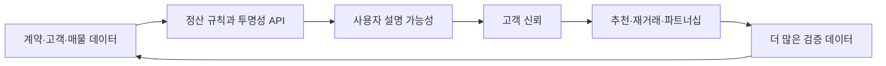
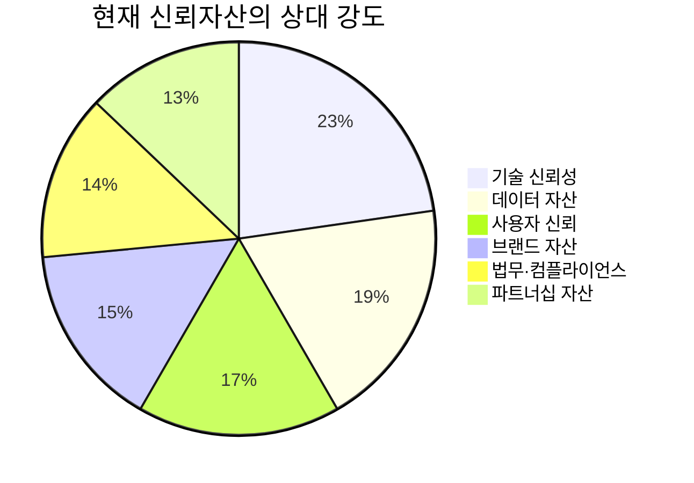
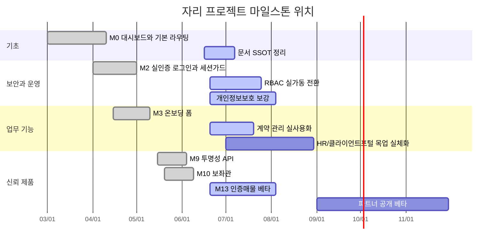

# [박제] 자리 프로젝트 심층 진단 보고서 (외부 딥리서치)

> **사관(CG) 주해 — 본문 위 박제 라벨.** 아래 본문은 **원문 그대로 보존**하며, 이 블록만 사관이 병기한다. (의장 지시: 2026-06-17 박제 + 메타·주석 병기)

## 메타정보 (출처·내력)

- **전달:** 2026-06-17 약 01:26 (KST), 의장 → CG(사관).
- **작성 주체:** 외부 AI — **ChatGPT 계열 딥리서치 기능**(하모니룸 체제의 GG와 *동일 벤더*). 사람이 쓴 1차 문헌이 아니라 AI 생성 2차 산출물.
- **가시 범위:** **공개 데이터 한정.** 원문 서두대로, 비공개 레포 `Ducksans/zari-harmony-room`은 404로 보지 못했고 공개 레포 `Ducksans/zarirealtorerp` 기준으로 진단함. (하모니룸은 *부재*가 아니라 *비공개*라 외부 AI 눈에 안 보인 것.)
- **박제 위치:** 본 레포(`zarirealtorerp`) 루트.

## 사관 주해 (신뢰 등급·취급법)

1. **비권위 스냅샷.** 본 보고서는 SSOT(GitHub)도, 사람의 1차 증언도 아닌 **외부 AI의 T시점 공개-스냅샷**이다. 권위 판정은 늘 SSOT로. 본문의 수치·점수(예: "신뢰자산 ≈ 44/100")는 *근거 있는 추정*이지 확정치가 아니다.
2. **보존이지 승인이 아님.** 박제 = 그 시점 산출물을 **출처와 함께 정직히 보존**하는 행위. 개별 주장의 채택·반박은 추후 실제 제품 개발 구간(하모니룸)에서 SSOT 대조로 판정한다.
3. **인용 토큰 안내.** 본문의 `cite…turn…` 표기는 **벤더 내부 인용 마커**로 여기선 클릭되지 않는다. 원문 충실성 위해 삭제하지 않고 그대로 둔다.
4. **유효성 판단.** 의장은 본 보고서가 *충분히 유효*하다 판단해 박제를 지시함(2026-06-17). 사관도 진단 골자 — *문서 정합성 부채·개인정보 설계 미비·RBAC 미완·목업/운영화 격차·"신뢰의 제품화" 우선* — 은 공개 코드 근거와 부합한다고 본다.

---

*이하 원문 — 수정 없이 보존.*

---

# 자리 프로젝트 심층 진단 보고서

## 요약

먼저 전제를 분명히 하겠습니다. 요청하신 `Ducksans/zari-harmony-room`는 공개 웹에서 확인되지 않았고 404 응답이 나왔습니다. 반면 Ducksans 공개 프로필에는 `zarirealtorerp`가 “자리부동산 erp 개발용 레포”로 공개되어 있어, 아래 평가는 **공개 확인이 가능한 현재 코드베이스인 `Ducksans/zarirealtorerp`를 기준으로 작성**했습니다. 따라서 비공개 저장소나 커넥터 내부 결과가 있다면 일부 판단은 달라질 수 있습니다. citeturn1view1turn47view0turn13view0

핵심 판단은 이렇습니다. 이 프로젝트는 **아이디어 단계는 이미 지났고**, 최소한 인증, 정산 로직, 계약/온보딩/투명성/신뢰 UI까지 연결된 **실전형 내부 운영 제품의 중후반 프로토타입**입니다. 다만 아직 **문서 정합성, 개인정보보호 설계, 파일증빙 스토리지, 권한관리 완성도, 운영 배포 표준화**가 부족해서 “잘 만든 내부 도구 후보”와 “외부에 약속 가능한 신뢰 플랫폼” 사이에 놓여 있습니다. 즉, 지금은 **기능 확장보다 신뢰 가능성의 제품화**가 더 시급한 시점입니다. citeturn19view0turn29view0turn23view0turn23view1turn23view2turn42view0

좋은 점도 명확합니다. 코드에는 이미 **실인증 로그인**, **HMAC 세션 쿠키**, **100원 룰 정산 엔진**, **8대 시나리오 회귀 테스트**, **투명성 API**, **결정론적 AI 보좌관**, **고객용 인증매물 페이지**, **온보딩 폼**이 있습니다. 특히 정산 테스트와 CI 품질 게이트는 “신뢰가 말이 아니라 재현 가능한 규칙과 검증”이라는 방향을 잘 잡고 있습니다. citeturn38view2turn37view0turn23view1turn23view2turn38view4turn38view3turn38view1turn38view0

반대로 가장 큰 리스크는 세 가지입니다. **첫째**, 문서가 현재 코드 상태를 따라가지 못합니다. 시스템 개요 문서는 “추가된 파일이 있으면 반드시 업데이트”라고 적어두었지만 실제 공개 트리에는 그 문서에 반영되지 않은 라우트와 API가 많이 늘어났습니다. **둘째**, 스키마에는 생년월일, 주민번호 뒷자리, 주소, 계좌번호 같은 민감한 필드가 들어 있는데, 코드상에서 암호화·마스킹·접근통제·보관주기 실행이 충분히 드러나지 않습니다. **셋째**, HR·클라이언트 포털처럼 아직 “목업”으로 남아 있는 구역이 있어서, 바깥에 보여줄 때 제품 신뢰와 실제 운영성 사이에 괴리가 생길 수 있습니다. citeturn48view0turn19view0turn29view0turn23view0turn40view0turn42view1turn44search0turn44search4

경영 관점에서 보면, 이 프로젝트가 당장 만들어내는 가장 큰 자산은 매출이 아니라 **신뢰 자산**입니다. 구체적으로는 **증빙 가능한 데이터 자산**, **투명성을 보여주는 브랜드 자산**, **규정 준수 가능성을 입증하는 법무/컴플라이언스 자산**, **고객이 안심하고 맡길 수 있게 만드는 사용자 신뢰 자산**, **건물주·법무사·세무사·제휴사와 붙기 쉬워지는 파트너십 자산**, **테스트·로그·권한관리로 설명 가능한 기술 신뢰 자산**입니다. 연구와 제도 측면에서도 디지털 플랫폼 신뢰는 구조적 보장, 투명성, 무결성, 보안, 설명가능성의 영향을 크게 받으며, 개인정보보호와 전자문서 신뢰성은 법적 기반이 분명합니다. citeturn45search17turn45search5turn45search7turn44search0turn44search2turn44search1

결론만 압축하면 이렇습니다. **지금은 “더 많은 기능”보다 “지금 있는 기능을 믿을 수 있게 만드는 90일”이 더 중요합니다.** 그 90일에 문서 정합화, 개인정보보호 보강, 파일증빙 체계, RBAC 실가동, 신뢰 페이지 실제 데이터 연결, 내부 파일럿 운영까지 끝내면, 6–12개월 안에 이 프로젝트는 단순 ERP가 아니라 **“신뢰를 제품으로 파는 중개사무소 운영체계”**가 될 수 있습니다. citeturn38view1turn38view2turn38view4turn23view2turn44search5turn44search0

## 분석 범위와 전제

이 평가는 공개 확인된 저장소를 기준으로 했습니다. 공개 코드베이스는 Next.js 16.2.7, React 19.2.4, Prisma 5.22, Vitest 4.1.8, Zod 4, Recharts 등을 사용하고 있으며, 최소한 앱 라우트 그룹은 20개 안팎, API 라우트 그룹은 16개 이상이 보입니다. 즉 “토이 프로젝트”가 아니라, 운영 도구와 대외 신뢰 화면을 함께 지향하는 다기능 제품 구조입니다. citeturn23view3turn19view0turn29view0

분석 기준은 네 축으로 두었습니다. 첫째는 **실제 동작 증거**입니다. 스키마, API, 프론트엔드, 테스트, CI가 실제로 존재하는지 봤습니다. 둘째는 **운영 준비도**입니다. 인증, 권한, 품질 게이트, 데이터 무결성, 배포 전제, 로그 체계가 어느 정도인지 봤습니다. 셋째는 **부동산 중개업에서의 신뢰 전환성**입니다. 공인중개사법상 확인·설명 의무, 전자문서/전자서명, 개인정보보호 요구를 실제 제품 신뢰 자산으로 바꿀 수 있는지 봤습니다. 넷째는 **문서와 코드의 정합성**입니다. SSOT가 살아 있는지, 아니면 코드가 문서를 앞질렀는지 봤습니다. citeturn23view0turn23view1turn23view2turn44search1turn44search2turn44search0turn48view0

사용자 특성상 중요한 전제도 있습니다. 대표님은 **부동산 중개업 사장님이면서 개발을 막 시작한 상태**라고 하셨습니다. 따라서 아래 제안은 “대규모 엔지니어링 조직” 기준이 아니라 **대표 + 소규모 팀**을 전제로 한 실무형 로드맵으로 설계했습니다. 다만 팀 규모, 예산, 외주 가능 범위, 목표 시장, 내부 인원 수, 월 거래량, 지점 수, 법인/개인 사업 형태는 **명시되지 않았으므로 미상**입니다. 그래서 금액 기반 재무가치가 아니라 **내부 관리용 신뢰자산 지수**와 실행 KPI 중심으로 제시합니다. 이 점은 해석에 반영했습니다. citeturn45search17turn44search0

또 한 가지 중요한 점은, 이 프로젝트는 이미 코드 차원에서 “신뢰”를 핵심 상품으로 다루고 있다는 사실입니다. `trust/page.tsx`는 “중개사의 선의가 아니라, 시스템이 신뢰를 보증한다”고 선언하고 있고, `api/transparency/route.ts`는 특정 직원 매출이 누구에게 얼마씩 흘렀는지 보여주는 100원 분해 추적기를 전제로 합니다. 이는 기능 개발을 넘어 **신뢰를 제품화하려는 전략**이 코드에 반영되어 있다는 뜻입니다. citeturn38view1turn37view4turn38view4

## 현재 코드베이스 상태

현재 공개 코드베이스에는 분명한 **실체 산출물**이 있습니다. 스키마에는 RBAC 모델, 사용자, 계약, 정산, 감사로그, 공지, 온보딩, 매물, 고객, 일정이 들어가 있고, 공개 앱 트리에는 `contracts`, `crm`, `customers`, `properties`, `onboarding`, `trust`, `client-portal`, `schedule`, `rulebook`, `showcase` 등 여러 기능 구역이 잡혀 있습니다. API 트리에도 `auth`, `dashboard`, `contracts`, `customers`, `properties`, `onboarding`, `settlement`, `transparency`, `assistant` 등이 보입니다. 즉 데이터 모델과 API, 화면 골격이 이미 꽤 넓게 펼쳐져 있습니다. citeturn23view0turn19view0turn29view0

완성도가 특히 높은 쪽은 **정산과 인증**입니다. 테스트 파일은 “100원 룰 + 수익 시뮬레이션 8대 시나리오 영구 박제 테스트”를 명시하고, 대표 확정 SSOT에서 드리프트하면 안 된다고 못 박습니다. CI 파이프라인도 의존성 설치 → Prisma generate → Type Check → Lint → Test → Build를 모두 강제합니다. 그리고 로그인 API는 “데모 하드코딩을 대체하는 실제 로그인 엔드포인트”로 바뀌었고, 성공 시 `zari_session` 쿠키를 발급합니다. 이 조합은 **정산 규칙의 재현성**과 **인증 체계의 최소 실전성**이 이미 확보되었다는 뜻입니다. citeturn23view1turn23view2turn38view2turn37view0

신뢰 제품으로 이어질 수 있는 요소도 강합니다. `api/transparency/route.ts`는 특정 직원의 월간 매출 흐름을 실데이터로 응답하도록 설계되어 있고, `api/assistant/route.ts`는 LLM이 아니라 `assistantBrain`의 결정론적 분석으로 답변을 생성한다고 적혀 있습니다. `trust/page.tsx`는 고객용 인증매물 목록, 인증 단계 배지, 타임라인 공개를 UI로 보여주며, “모든 매물은 현장 인증·서류 검증·타임라인 공개를 거친다”는 메시지를 전면에 둡니다. 이건 단순 홍보 문구가 아니라, **투명성·설명가능성·증빙성**을 한 제품 안에 묶으려는 시도로 읽힙니다. citeturn38view4turn38view3turn37view2turn38view1turn37view4

하지만 빠진 부분도 뚜렷합니다. 대표적으로 **문서 정합성 부채**가 큽니다. `system_overview.md`는 “파일이 추가되거나 역할이 변경될 경우 반드시 함께 업데이트”하라고 적어두지만, 실제 문서에 적힌 범위는 `users/contracts/settlement/dashboard/seed/notices` 수준이고, 현재 공개 코드 트리의 `auth`, `assistant`, `transparency`, `onboarding`, `trust`, `client-portal`, `schedule`, `showcase`, `rulebook` 등은 충분히 반영되지 않았습니다. `SYSTEM_ARCHITECTURE.md`는 검증 프레임워크를 “Zod 도입 예정”으로 적어두는데, 실제 로그인·보좌관 엔드포인트는 이미 Zod를 쓰고 있습니다. 즉 **코드는 문서보다 앞서 갔고, SSOT가 이미 흔들리고 있습니다.** citeturn48view0turn16view0turn29view0turn38view2turn37view2

기술부채도 명확합니다. 스키마에는 `role`이 “Legacy String role (will be deprecated)”로 남아 있는데, 로그인 토큰은 여전히 그 `role`을 사용합니다. 즉 RBAC 모델은 스키마에 들어왔지만, 실제 권한체계는 **완전 전환 전 상태**입니다. 게다가 `proxy.ts`는 보호 경로에서 쿠키의 **존재 여부만 낙관적으로 검사**하고, 서명·만료 검증은 다른 API에 맡긴다고 밝힙니다. 이는 개발 단계에선 실용적이지만, 대표님이 외부 파트너에게 “권한과 보안이 믿을 만하다”고 말하기에는 아직 약한 구조입니다. citeturn23view0turn38view2turn41view0turn42view0

운영 전환의 즉시 장애물도 있습니다. 첫째, 데이터베이스가 스키마상 SQLite로 잡혀 있고, 저장소 트리에도 `dev.db`가 포함되어 있습니다. 둘째, 온보딩 화면은 첨부파일 업로드가 아니라 **문서 URL 입력** 방식입니다. 셋째, HR 화면은 스스로 “프론트엔드 목업”이며 DB 연결 예정이라고 적고 있고, 클라이언트 포털도 `ClientPortalMockup`으로 남아 있습니다. 넷째, 공개 저장소 기준으로 Releases는 없고, Issues/PR/Projects도 거의 비어 있습니다. 요약하면 **기능은 많지만 운영 표준과 배포/협업 자산은 아직 얇습니다.** citeturn23view0turn18view0turn34view2turn33view7turn40view0turn42view1turn13view0turn47view0

이 상태를 한 문장으로 요약하면 이렇습니다. **“정산·인증·신뢰 UX 쪽은 생각보다 앞서 있지만, 보안·권한·문서·운영화는 아직 뒤따라와야 한다.”** 이게 지금 프로젝트의 가장 정확한 위치입니다. citeturn23view1turn23view2turn38view1turn42view0turn48view0

## 신뢰 자산 진단

이 프로젝트로 쌓을 수 있는 신뢰 자산은 여섯 갈래입니다. 첫째는 **데이터 자산**입니다. 계약, 고객, 매물, 일정, 서류, 정산, 감사 이벤트를 하나의 구조 안에 축적할 수 있기 때문입니다. 둘째는 **브랜드 자산**입니다. “자리 인증매물”, “투명성 API”, “결정론적 보좌관” 같은 표현은 단순 광고가 아니라 브랜드 메시지로 전환될 수 있습니다. 셋째는 **법무·컴플라이언스 자산**입니다. 공인중개사법상 확인·설명 문서, 전자문서·전자서명 신뢰성, 개인정보보호 체계를 시스템에 묶을 수 있기 때문입니다. 넷째는 **사용자 신뢰 자산**입니다. 고객이 “누가 말했는지”보다 “무슨 증빙이 남는지”를 보게 만드는 구조입니다. 다섯째는 **파트너십 자산**입니다. 건물주, 법무사, 세무사, 촬영/VR, 전자계약 파트너에게 설명 가능한 프로세스가 생깁니다. 여섯째는 **기술 신뢰 자산**입니다. 테스트, 품질 게이트, 로그, 권한체계가 외부 약속의 근거가 됩니다. citeturn23view0turn23view1turn23view2turn38view1turn38view4turn38view3turn44search1turn44search2turn44search0

법과 제도 측면에서는 방향이 맞습니다. 공인중개사법은 중개의 전문성과 건전한 육성을 법 목적에 두고 있고, 국토교통부 Q&A도 중개가 완성되어 계약서를 작성할 때 **중개대상물 확인·설명서를 서면으로 교부**해야 한다는 점을 다시 확인합니다. 전자서명법은 전자문서의 안전성과 신뢰성 확보를 목적으로 합니다. 개인정보보호위원회의 안전성 확보조치 기준도 개인정보의 분실·도난·유출·위조·변조·훼손 방지를 위한 최소 기준을 요구하고, 안내서는 위험도에 따라 추가 보호조치 적용을 권고합니다. 즉 귀하의 제품이 계약서류·확인설명서·증빙타임라인·접근통제·전자서명·감사로그를 잘 묶어내면, 그것 자체가 법적 신뢰의 일부가 됩니다. citeturn44search1turn44search5turn44search2turn44search0turn44search4

연구 측면에서도 같은 결론이 나옵니다. 디지털 플랫폼 신뢰에 관한 메타분석과 실증연구는 **구조적 보장, 무결성, 역량, 친숙성, 투명성**이 신뢰 형성의 핵심 변수라고 봅니다. 설명가능성과 사회적 투명성에 관한 연구도, 사용자가 시스템을 신뢰하는 데는 “정답”만이 아니라 **왜 그렇게 나왔는지, 어떤 맥락과 절차를 거쳤는지**가 중요하다고 봅니다. 귀하 프로젝트의 `transparency`와 `assistant` 설계는 바로 이 지점과 맞물립니다. citeturn45search17turn45search5turn45search7turn45search1

문제는 현재 이 자산이 **잠재자산**인지, **현금화 가능한 자산**인지의 차이입니다. 예를 들어 데이터 자산은 스키마상 이미 넓지만, 아직 업로드 스토리지/보존정책/권한관리/감사조회가 완성되지 않아 “쌓을 수 있는 구조”에 가깝습니다. 브랜드 자산도 `ZARI TRUST` 같은 메시지가 있으나, 외부 링크 가능한 운영 사례·후기·파트너 배지·공개 SLA가 없어 “브랜딩 소재” 단계입니다. 반면 기술 신뢰 자산은 테스트와 CI가 있어 상대적으로 실제성이 높습니다. citeturn23view0turn23view1turn23view2turn37view4turn38view3

그래서 여기서는 금융가치가 아니라 **내부 관리용 신뢰자산 지수**로 보는 것이 현실적입니다. 아래 점수는 매출 평가가 아니라, 현재 코드 증거와 법/연구 기준을 반영한 **운영 신뢰도 점수**입니다. 팀 규모·매물 수·지점 수·월 거래량이 미상이므로, 절대가치보다 **상승 폭**을 보는 것이 맞습니다. citeturn45search17turn44search0turn44search1

| 신뢰 자산 범주 | 현재 상태 | 현재 점수 | 단기 기대 | 중기 기대 |
|---|---|---:|---:|---:|
| 데이터 자산 | 구조는 넓음, 운영체계는 미완 | 2.5 / 5 | 3.5 / 5 | 4.3 / 5 |
| 브랜드 자산 | 메시지는 강함, 사례는 부족 | 2.0 / 5 | 3.0 / 5 | 4.0 / 5 |
| 법무·컴플라이언스 | 필요 항목 인식은 있음, 실행증빙 부족 | 1.8 / 5 | 3.2 / 5 | 4.2 / 5 |
| 사용자 신뢰 | 신뢰 UI/투명성 개념 존재 | 2.2 / 5 | 3.4 / 5 | 4.4 / 5 |
| 파트너십 자산 | 설명 가능한 스토리 존재 | 1.7 / 5 | 2.8 / 5 | 4.0 / 5 |
| 기술 신뢰성 | 테스트/CI/실인증이 강점 | 3.0 / 5 | 3.8 / 5 | 4.3 / 5 |

위 표를 가중합으로 바꾸면, **현재 신뢰자산 지수는 약 44/100**, 1–3개월 집중 보강 후 **58–65/100**, 6–12개월 운영 증거가 붙으면 **72–81/100**까지 볼 수 있습니다. 이 숫자는 시장평가액이 아니라 “외부에 자신 있게 보여줄 수 있는 신뢰도”를 관리하는 내부 지표로 보시면 됩니다. 현재 점수가 낮은 이유는 기능 부족보다 **컴플라이언스 실행증거와 운영사례의 부족** 때문입니다. 반대로 단기 상승 여지가 큰 이유는 이미 코드 안에 재료가 많이 들어 있어, 새 기능보다 **보강 작업**으로 점수 상승이 가능하기 때문입니다. citeturn23view0turn23view2turn38view1turn42view0turn44search0turn45search17

## 프로젝트 타임라인 위치

현재 위치를 마일스톤 언어로 정리하면, 이 프로젝트는 **M0–M13 사이를 이미 통과하면서 일부 마일스톤은 구현, 일부는 목업, 일부는 운영화 직전**에 있습니다. 공개 코드에는 파일별 마일스톤 주석이 많이 남아 있어 추적이 가능합니다. 메인 대시보드는 M0, 실인증 로그인은 M2, 온보딩은 M3, 투명성 API는 M9, AI 보좌관은 M10, 고객용 인증매물은 M13으로 표기됩니다. 이를 보면 “아이디어 → 화면 → 인증 → 운영 로직 → 신뢰 제품” 순으로 진화한 흔적이 분명합니다. citeturn38view5turn38view2turn38view0turn38view4turn38view3turn38view1

다만 마일스톤이 곧바로 “완료”를 뜻하지는 않습니다. 예를 들어 HR 페이지는 파일 상단 메타에서는 M3 목업 성격을 드러내고, 본문에서도 대표 지시에 따라 백엔드 구축 이전 UI 청사진이라고 명시합니다. 반면 로그인 API는 데모 하드코딩을 실제 로그인으로 대체했다고 적습니다. 즉 **같은 제품 안에 완료된 영역과 청사진 영역이 공존**합니다. 이 점이 지금 대표님이 느끼는 혼란의 본질일 가능성이 큽니다. 제품은 커졌는데, 어디까지가 진짜 완성인지 한눈에 안 잡히는 상태입니다. citeturn40view0turn38view2

제가 보기에는 이미 끝난 것, 진행 중인 것, 아직 시작하지 않은 것을 다음처럼 보시면 가장 실용적입니다. **완료에 가까운 것**은 정산 규칙/테스트, 최소 실인증 로그인, 세션 가드, 계약 관리 메인, 온보딩 제출 흐름, 투명성 API, 고객용 인증매물 콘셉트 화면입니다. **진행 중인 것**은 RBAC 전환, 고객/매물/일정/포털의 실제 운영 연결, 신뢰 화면 실증 데이터화, AI 보좌관의 조직 내 활용도 고도화입니다. **사실상 미착수에 가까운 것**은 운영 보안 기준 문서화, 개인정보 수명주기 관리, 파일 업로드/보관/전자서명/증빙 원장화, 운영 모니터링, 외부 파트너용 대시보드, 고객/파트너 대상 SLA 수준 공개입니다. citeturn23view1turn38view2turn42view0turn40view1turn38view0turn38view4turn38view1turn40view0

실무적으로 말하면, 대표님은 지금 **“개발 초보가 겨우 첫 화면을 만든 단계”가 아니라, “제품 골격은 거의 세웠고 이제 운영 신뢰를 붙여야 하는 단계”**에 있습니다. 이 차이를 이해하는 것이 중요합니다. 지금 필요한 역량은 코드를 더 많이 쓰는 능력보다 **무엇을 먼저 닫아야 외부에서 믿어주는지 판단하는 능력**입니다. citeturn23view2turn42view0turn44search0turn45search17

## 실행 로드맵과 커뮤니케이션

앞의 진단을 실행으로 바꾸면, 향후 1–3개월은 **신뢰 가능성의 제품화**, 6–12개월은 **신뢰를 시장 자산으로 전환**하는 기간으로 나누는 것이 맞습니다. 단기에는 있는 기능의 정확도·안전성·설명가능성을 닫아야 하고, 중기에는 그 결과를 고객·오너·제휴사에게 증명 가능한 포맷으로 확장해야 합니다. 아래 표는 아티팩트, 기간, 담당, 노력, 성공지표, 신뢰자산 효과를 한 번에 보도록 만든 요약표입니다. 표의 현재 상태 판단은 위 코드 근거와 외부 제도 기준을 바탕으로 한 실무 해석입니다. citeturn23view0turn23view2turn38view1turn42view0turn44search0turn44search1turn44search2

| 아티팩트 | 현재 상태 | 권장 시점 | 권장 담당 | 예상 노력 | 성공 지표 | 신뢰자산 영향 |
|---|---|---|---|---|---|---|
| 저장소 정체성 정리와 SSOT 문서 | 미흡 | 즉시 | 대표 | 1–2일 | `README`, `SYSTEM_ARCHITECTURE`, `system_overview` 동기화 | 브랜드, 기술 |
| 개인정보보호 보강 | 긴급 | 2주 | 대표+외주 1명 가능 | 5–8일 | 암호화/마스킹/접근로그/보존정책 반영 | 법무, 사용자 |
| dev DB 제거와 환경 분리 | 긴급 | 1주 | 대표 | 1–2일 | 저장소에서 로컬 DB 제거, `.env` 정책 정리 | 기술, 법무 |
| RBAC 실가동 | 중요 | 3–4주 | 대표 | 4–6일 | role legacy 의존 감소, 권한별 화면/API 차등 | 기술, 법무 |
| 증빙 업로드 스토리지 | 중요 | 3–4주 | 대표+외주 | 5–7일 | URL 입력 제거, 파일 업로드·메타데이터 기록 | 데이터, 사용자 |
| 신뢰 페이지 실데이터 베타 | 중요 | 4–6주 | 대표 | 4–5일 | 인증 매물 20건 이상, 타임라인 노출 | 브랜드, 사용자 |
| 고객/매물/계약 연결 보강 | 중요 | 4–8주 | 대표 | 6–10일 | 계약-매물-고객 전체 추적 가능 | 데이터, 사용자 |
| 내부 파일럿 운영 | 중요 | 6–8주 | 대표+팀 | 2주 운영 | 내부 사용자 3–5명, 오류/요청 수집 | 기술, 파트너십 |
| 사용자/파트너 신뢰 메시지 공개 | 중요 | 6주 | 대표 | 1–2일 | 소개문·약속문·개인정보 안내 공개 | 브랜드, 파트너십 |
| 운영 모니터링과 릴리스 루틴 | 중기 초입 | 2–3개월 | 대표 | 3–4일 | 릴리스 노트, 장애 대응 기준, 백업 점검 | 기술, 브랜드 |
| 전자문서·전자서명 연동 | 중기 | 3–6개월 | 대표+외주 | 2–4주 | 전자서명 문서 흐름 완성 | 법무, 사용자 |
| 파트너 포털/오너 포털 | 중기 | 6–12개월 | 소규모 팀 | 4–8주 | 오너/법무사/세무사 협업 화면 | 파트너십, 브랜드 |

단기 1–3개월 로드맵을 더 구체적으로 적으면 이렇습니다. **대표 혼자 또는 소규모 팀**이라는 전제에서, 첫 달은 문서·보안·권한을 닫고, 둘째 달은 증빙/신뢰 화면을 실제 데이터에 연결하고, 셋째 달은 내부 파일럿과 외부 소개문을 준비하는 식이 가장 효율적입니다. 특히 `system_overview.md`와 현재 트리의 불일치는 지금 당장 고쳐야 합니다. 문서가 맞지 않으면 앞으로 대표님 본인도 “뭐가 어디 있는지” 매번 다시 파악해야 하고, 외주나 협업도 훨씬 비싸집니다. citeturn48view0turn19view0turn29view0

중기 6–12개월 로드맵은 “ERP”를 “신뢰 플랫폼”으로 바꾸는 과정입니다. 여기서 목표는 기능 수가 아니라 **증빙 가능한 운영 결과**입니다. 예를 들어 `trust` 페이지는 단순 리스트가 아니라 “인증 완료 매물 수”, “서류 완비율”, “현장 인증률”, “확인·설명서 교부율”, “전자서명 전환율”, “계약 문서 누락률”, “고객 안심 지표” 같은 KPI를 갖춰야 합니다. 법적으로도 확인·설명서 교부, 전자문서의 신뢰성, 개인정보 안전성 확보는 외부 신뢰를 만드는 핵심 축이므로, 중기 KPI는 결국 **법적 요건의 운영 가시화**로 수렴하는 것이 맞습니다. citeturn37view4turn44search1turn44search5turn44search2turn44search0

중기 KPI는 다음처럼 두면 현실적입니다. 인증매물 등록 100건 이상, 인증 완료율 60% 이상, 문서 누락률 5% 이하, 내부 정산 재작업률 50% 이상 감소, 로그인 성공률 95% 이상, 권한오류 제로, 내부 사용자 주간 활성률 70% 이상, 전자문서 전환율 50% 이상, 고객/오너용 링크 공유 건수 월 30건 이상, 파트너사 파일럿 2곳 이상입니다. 이 수치는 외부 벤치마크가 아니라 귀사 규모가 미상인 상태에서 제시하는 **운영형 목표치**입니다. 시작은 작게 해도 됩니다. 중요한 것은 “측정 지표가 있고, 그 지표가 신뢰와 연결되어 있는가”입니다. citeturn45search17turn44search0turn44search1

지금 바로 실행할 **우선순위 10개 체크리스트**는 아래 순서가 좋습니다.

1. `README`, `SYSTEM_ARCHITECTURE`, `system_overview`를 현재 코드트리 기준으로 하루 안에 동기화합니다. 문서 부채를 먼저 끊어야 이후 판단비용이 줄어듭니다. citeturn48view0turn16view0  
2. 저장소에 포함된 로컬 DB와 테스트 데이터 흔적을 정리하고, 운영/개발 환경 분리를 명문화합니다. SQLite는 개발엔 유용하지만 운영 기준은 아닙니다. citeturn23view0turn18view0  
3. 주민번호 뒷자리, 계좌번호, 생년월일, 주소, 전화번호 필드에 대해 암호화·마스킹·조회권한·보존기간 정책을 먼저 도입합니다. citeturn23view0turn44search0turn44search4  
4. legacy `role` 중심 인증을 RBAC 중심으로 전환하고, 최소한 관리자/팀장/실무자 권한 차등을 API와 화면 모두에 적용합니다. citeturn23view0turn38view2turn42view0  
5. 온보딩과 계약 증빙의 “URL 입력”을 실제 업로드 스토리지와 메타데이터 기록으로 바꿉니다. 이게 없으면 신뢰 제품이 아니라 링크 수집기처럼 보입니다. citeturn34view2turn33view7  
6. `trust` 페이지를 실데이터와 연결하고, 인증 배지 로직·문서 완비율·타임라인을 실제 계약/서류 데이터와 묶습니다. citeturn38view1turn37view4  
7. `transparency` API를 UI에 붙여 “누가 얼마를 가져갔는가”를 내부에서 바로 설명할 수 있게 만듭니다. 정산 분쟁 비용이 크게 줄어듭니다. citeturn38view4turn23view1  
8. HR와 Client Portal의 목업 상태를 명확히 구분하고, 외부 공개 화면에는 “운영 중 기능”만 노출합니다. 아직 목업을 제품처럼 보이게 하면 신뢰를 깎습니다. citeturn40view0turn42view1  
9. 내부 파일럿을 3–5명 규모로 돌리면서 오류·질문·누락 데이터를 수집합니다. 정말 필요한 기능과 보기 좋은 기능을 구분하게 됩니다. citeturn23view2turn45search17  
10. 사용자/오너/파트너에게 보낼 신뢰 메시지 템플릿을 만들고, “무엇을 약속하고 무엇은 아직 베타인지”를 분명히 말합니다. 투명한 기대관리 자체가 신뢰 자산입니다. citeturn45search7turn45search17

아래는 실제로 바로 쓸 수 있는 **신뢰 구축용 커뮤니케이션 템플릿**입니다. 제품이 아직 완성형이 아니어도, 메시지가 정직하면 신뢰는 오히려 올라갑니다.

**고객 공지용 메시지**

> 안녕하세요. 자리 공인중개사 사무소입니다.  
> 저희는 매물 소개를 ‘설명’만으로 하지 않고, 확인·설명서, 권리관계 서류, 현장 인증 기록, 계약 진행 타임라인을 체계적으로 관리하는 방식으로 바꾸고 있습니다.  
> 현재 일부 기능은 베타 운영 중이며, 검증이 끝난 매물부터 ‘자리 인증매물’로 안내드립니다.  
> 아직 베타인 기능은 명확히 표시하고, 고객님이 확인하실 수 있는 증빙부터 우선 공개하겠습니다. citeturn37view4turn44search5turn44search2

**오너·집주인 제안 메시지**

> 안녕하세요. 자리 공인중개사 사무소입니다.  
> 저희는 매물을 더 빨리 광고하는 것보다, 더 신뢰받게 공개하는 체계를 만들고 있습니다.  
> 계약서류, 중개대상물 확인·설명서, 권리관계 확인자료, 현장 인증 기록을 바탕으로 ‘검증 가능한 매물’로 관리해 드릴 수 있습니다.  
> 허위·과장 없이, 공개 가능한 범위와 비공개 관리 범위를 구분해 운영하겠습니다. citeturn38view1turn44search1turn44search5

**법무사·세무사·제휴 파트너 제안 메시지**

> 안녕하세요. 자리 공인중개사 사무소입니다.  
> 당사는 중개 업무를 정산, 증빙, 권한관리, 인증매물, 고객 커뮤니케이션까지 하나의 운영 시스템으로 정리하는 중입니다.  
> 파트너와는 ‘말로 맞추는 협업’이 아니라, 동일한 증빙과 동일한 타임라인을 보는 협업을 지향합니다.  
> 현재 베타 단계이므로, 먼저 소규모 파일럿으로 프로세스 적합성을 함께 검증해 보고 싶습니다. citeturn38view4turn38view1turn44search2turn45search17

마지막으로, 대표님이 매주 확인할 **중기 리스크 완화 포인트**를 짧게 적겠습니다. 개인정보 리스크는 암호화·권한·보존 주기 없이는 가장 큰 폭탄입니다. 제품 리스크는 목업과 운영 기능을 섞어 보여주는 순간 커집니다. 브랜드 리스크는 “신뢰”를 약속했는데 증빙 화면이 비어 있으면 즉시 생깁니다. 반대로, 정산 테스트·CI·실인증 로그인·투명성 API·인증매물 베타를 같은 스토리로 엮어내면, 귀사의 차별점은 “매물을 많이 아는 중개사”가 아니라 **“신뢰를 시스템으로 남기는 중개사”**가 됩니다. 그 차이는 중장기적으로 가격 경쟁보다 강한 자산이 될 가능성이 큽니다. citeturn23view1turn23view2turn38view2turn38view4turn38view1turn45search17turn45search7

**주요 근거 출처**: Ducksans 공개 GitHub 프로필 및 `zarirealtorerp` 저장소, 저장소 내 `package.json`, `prisma/schema.prisma`, `tests/settlement.scenarios.test.ts`, `src/app/*`, `src/app/api/*`, `src/proxy.ts`, `system_overview.md`, `SYSTEM_ARCHITECTURE.md`; 국가법령정보센터의 개인정보보호·공인중개사법·전자서명법 관련 자료; 개인정보보호위원회/KISA 안전성 확보조치 자료; 디지털 플랫폼 신뢰 및 투명성 관련 최신 실증·메타분석 연구. citeturn47view0turn13view0turn23view3turn23view0turn23view1turn23view2turn38view2turn38view4turn38view1turn42view0turn48view0turn16view0turn44search0turn44search1turn44search2turn44search4turn45search17turn45search5turn45search7